AWS - API GATEWAY 사용 방법 (AWS 통합을 사용한 구축)
==============================================================================
### 1. API GATEWAY를 사용하기 위한 설정

1. AWS 회원가입, IAM 권한등록 (대부분의 aws 서비스의 공통사항으로 추후 문서화)

### 2. API 생성

1. 서비스 목록에서 API Gateway 클릭
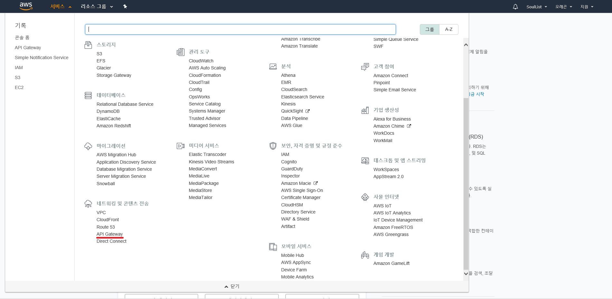
2. 리전을 서울로 변경 후에 시작 클릭
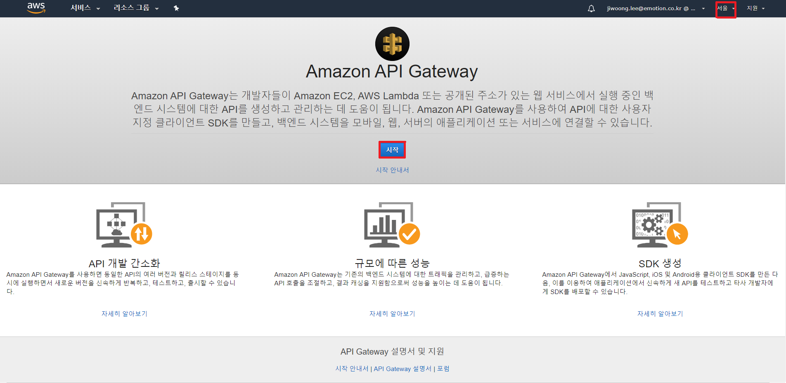
3. 확인 클릭
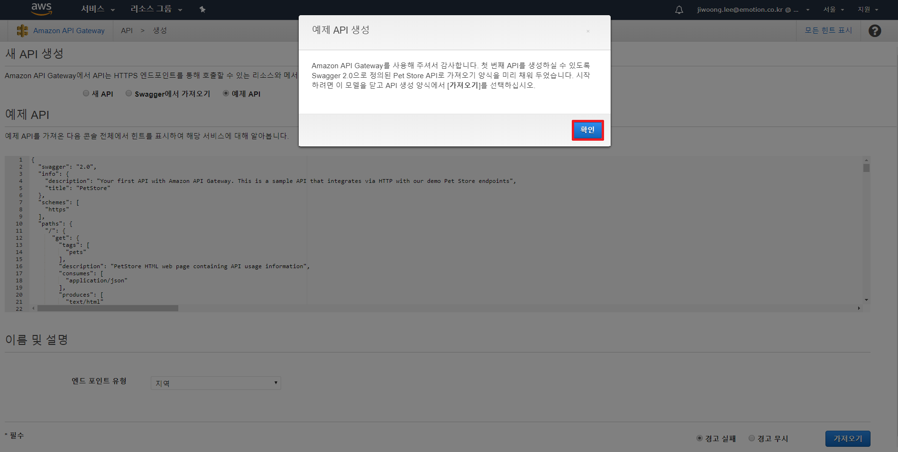
4. 가져오기 클릭
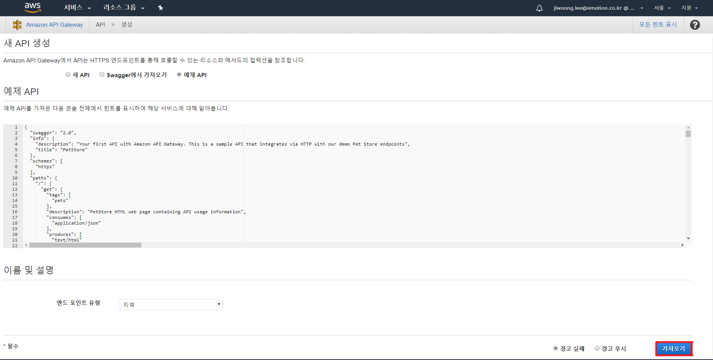
5. 생성된 API 확인
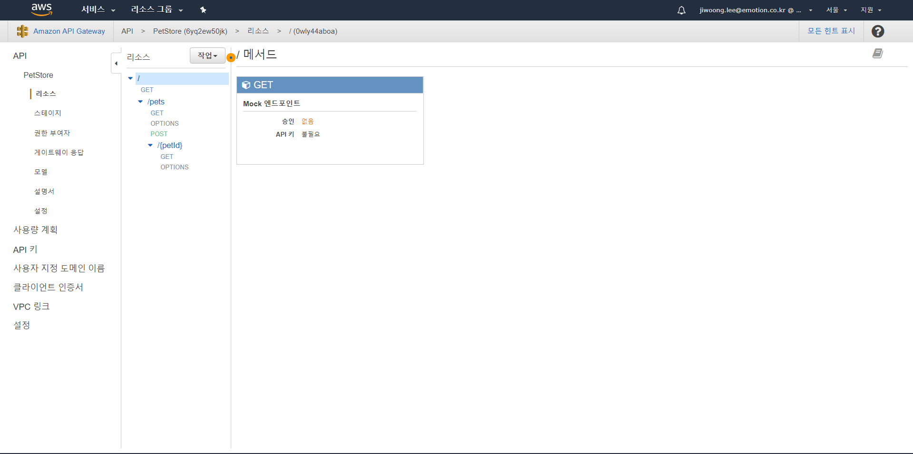
6. API KEY를 통한 인증절차 추가
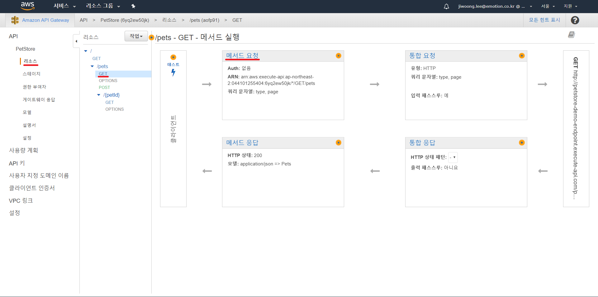
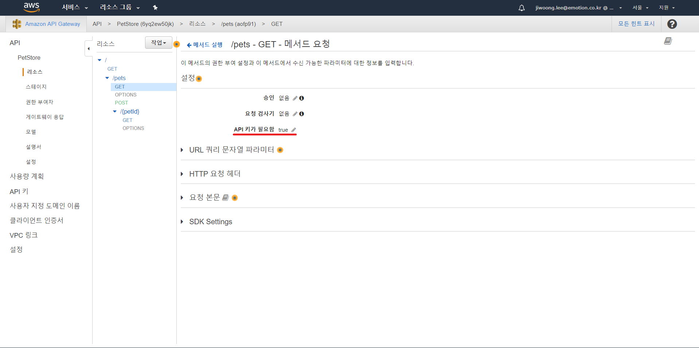

### 3. 배포
1. 작업 select box에서 API배포 선택
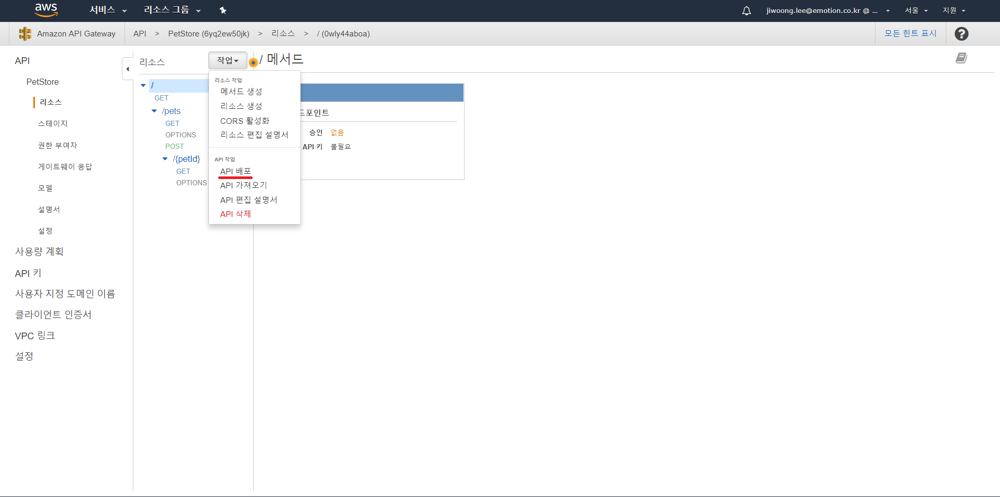
2. 목록 작성 후 배포 버튼 클릭. 생성된 스테이지 서버 확인
	※ 최초 배포 시에는 자동으로 스테이지가 생성되지만 이후에는 추가적으로 스테이지 서버를 생성해 주어야 한다.
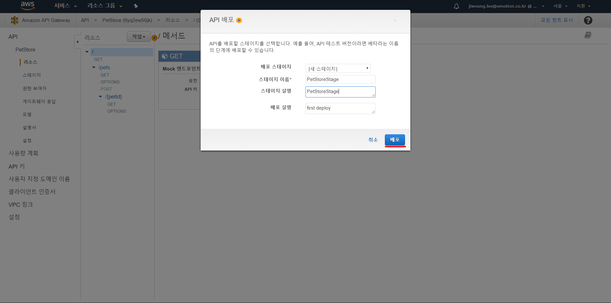
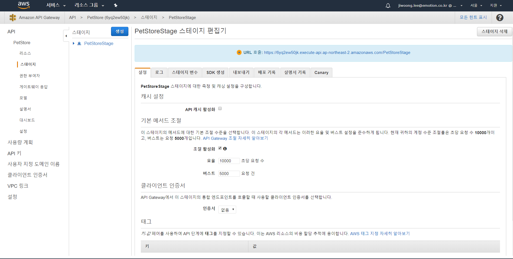

### 4. 사용량 계획 생성
1. 좌측 메뉴 바에서 사용량 계획 클릭, 메인 화면에서 생성 버튼 클릭 후 목록 작성하여 다음 버튼 클릭
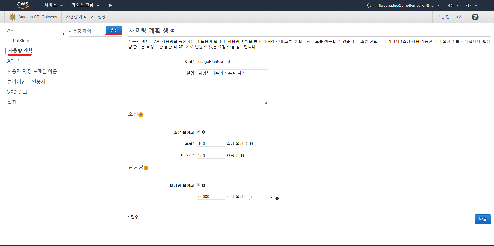

2. API 스테이지 추가 버튼 클릭, API와 해당 스테이지 선택 후 다음 버튼 클릭
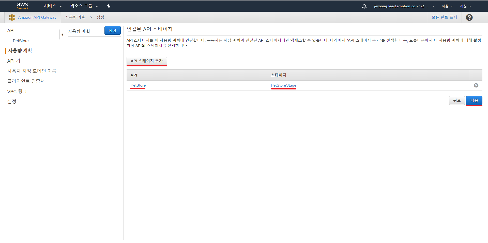

3. 완료 버튼 클릭하여 사용량 계획 생성
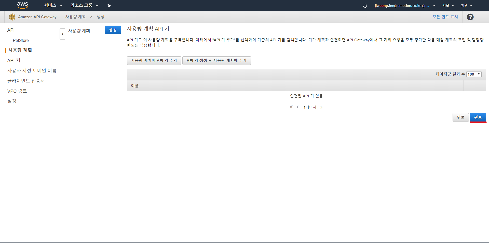

### 5. API 키 생성
1. 좌측 메뉴 바에서 API 키 클릭, 메인 화면에서 작업 select box 클릭 후 API 키 생성 선택, 메인 목록 작성하여 저장 버튼 클릭
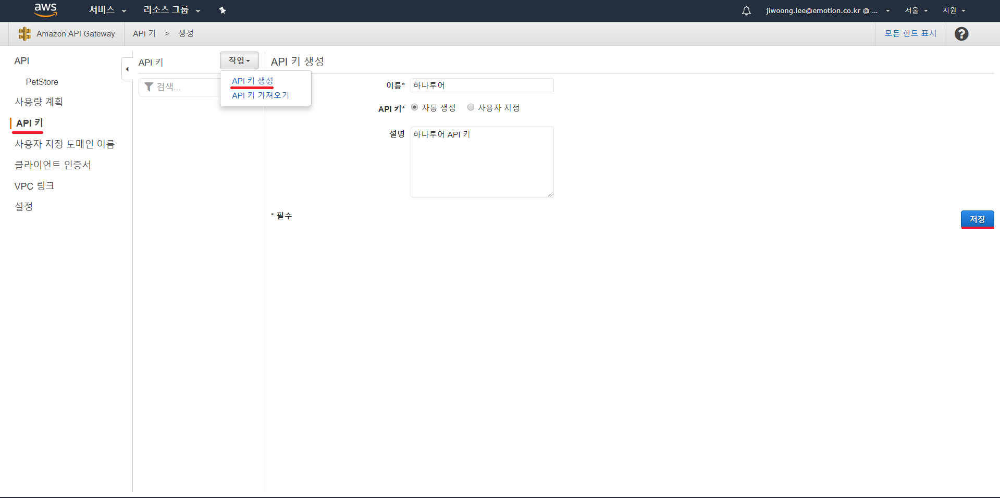

2. 사용량 계획에 추가 버튼 클릭 후 생성한 사용량 계획을 추가
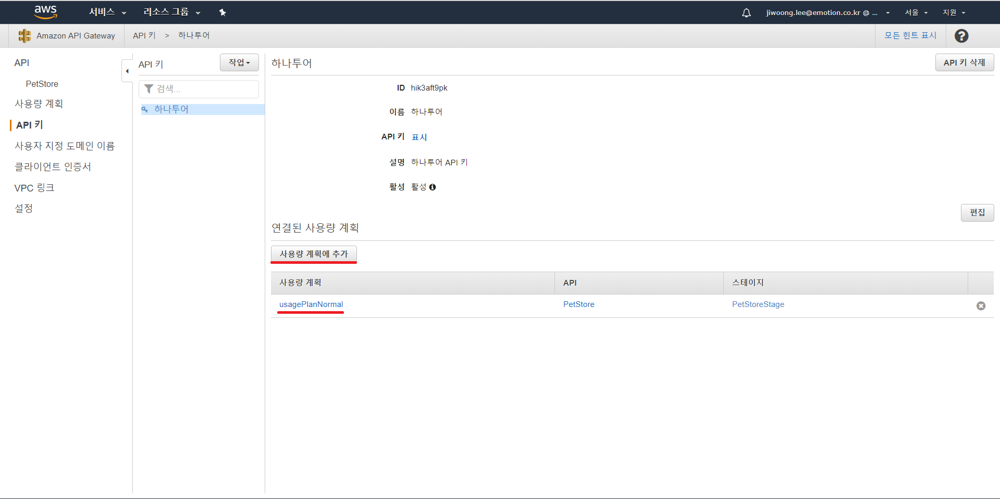

### 6. API 테스트 (post man 사용)
1. 스테이지 URL 확인
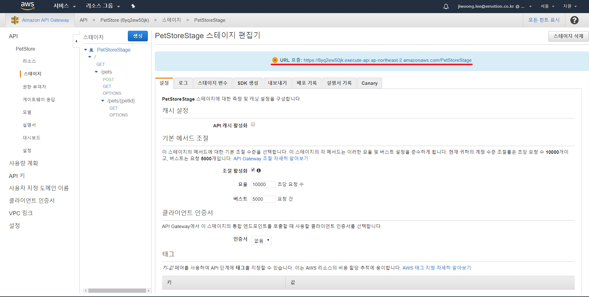

2. API KEY 인증 추가한 URL의 METHOD로 확인
	※ HEADER 정보에 API KEY의 값이 없기에 접근이 불가하다
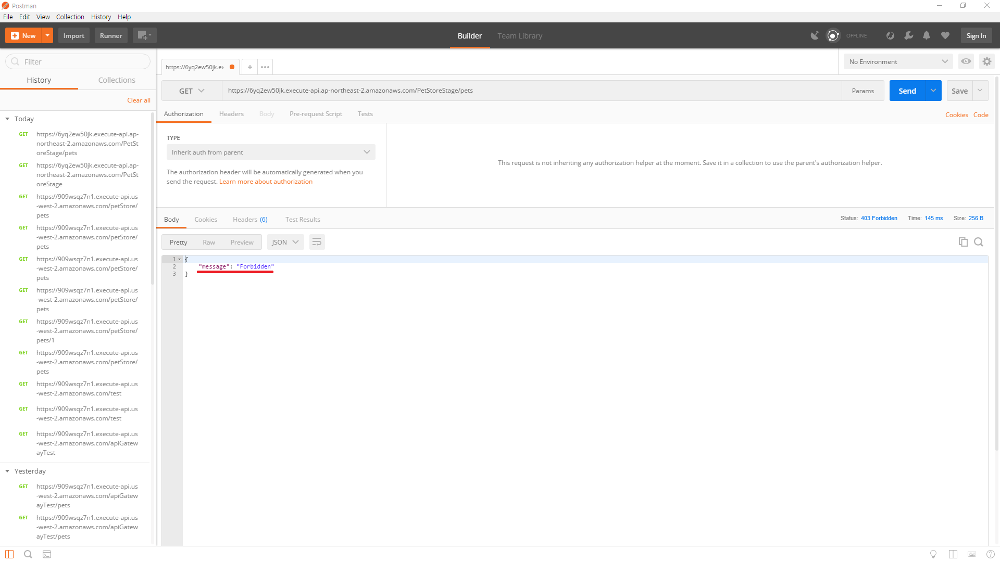

3. API KEY 추가하여 확인
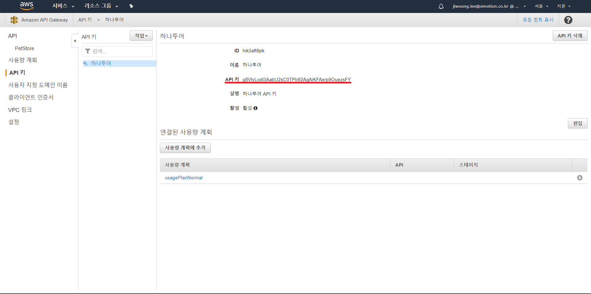
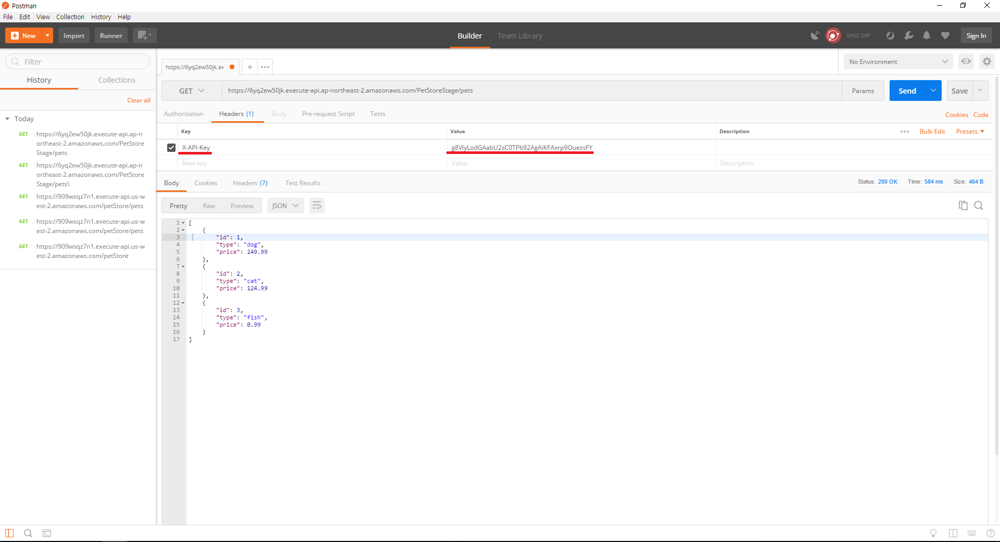
※ 참조 : https://docs.aws.amazon.com/ko_kr/apigateway/latest/developerguide/api-gateway-api-usage-plans.html