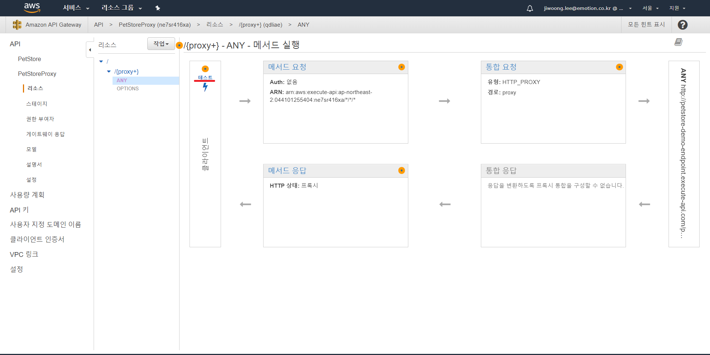

AWS - API GATEWAY 사용 방법 (HTTP 프록시 통합을 사용하여 API 구축)
==============================================================================
### 1. API GATEWAY를 사용하기 위한 설정

1. AWS 회원가입, IAM 권한등록 (대부분의 aws 서비스의 공통사항으로 추후 문서화)

### 2. API 생성

1. 서비스 목록에서 API Gateway 클릭

2. 리전을 서울로 변경 후에 시작 클릭

3. 새로운 API생성

4. 목록 작성 후, API 생성버튼 클릭
※ 엔드 포인트 유형 참조 : https://aws.amazon.com/ko/about-aws/whats-new/2017/11/amazon-api-gateway-supports-regional-api-endpoints/

5. 리소스 생성

6. 목록 체크 후, 리소스 생성 버튼 클릭

7. 엔드포인트 설정
※ test를 위한 엔드포인트 : http://petstore-demo-endpoint.execute-api.com/petstore
	- 참조 : https://docs.aws.amazon.com/ko_kr/apigateway/latest/developerguide/api-gateway-create-api-from-example.html
- 

### 3. API 테스트
1. API 테스트 문구 클릭

2. API 테스트 목록 작성 후, 테스트 버튼 클릭

3. 응답 정보 확인
