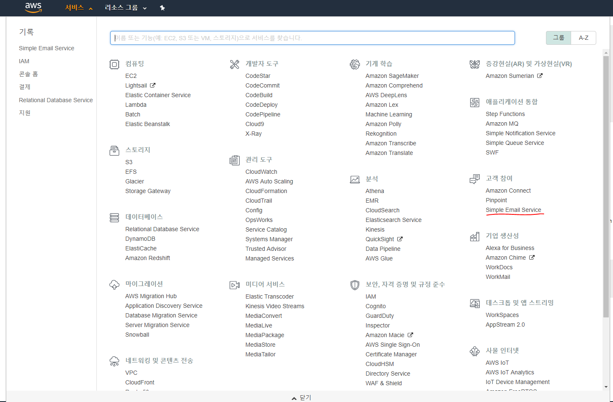
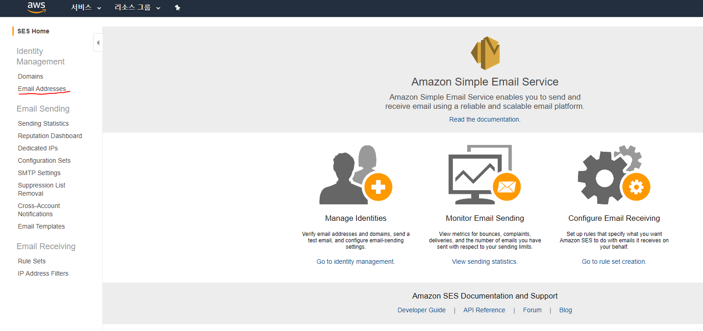

AWS SES MAIL발송 사용 예제
==============================================================================

### ※ 시작 전 압축된 정보
1. SES는 **Simple Email Service**의 약자로 메일 관련된 서비스이다.

2. 아래는 해당 서비스로 사용할 수 있는 몇가지 예이다.
	- 메일발송
	- 메일수신등

3. SES로도 여러명의 대상자들에게 메일발송이 가능하나 **SNS**의 구독 기능으로도 가능하다.
	사용의 예) SES -> 로그인 임시비밀번호 발송, SNS -> 마케팅 이메일 발송

4. 해당 서비스들은 **CloudWatch**를 통해 모니터링 및 로그 확인이 가능하다.

### 1. AWS SES 환경구성

1. AWS 회원가입, IAM 권한등록, 액세스 키 생성 (대부분의 aws 서비스의 공통사항으로 추후 문서화)
   - 자격 증명 등록
   		- 자격 증명에 대한 종류는 여러가지가 존재하나 해당 예제에서는 AWS에서 권장하는 방법으로 수행한다.
   		- 아래의 해당되는 위치에 ACCESS_KEY, SECRET_KEY를 입력
   			Linux, macOS, or Unix : ~/.aws/credentials
			Windows : C:\Users\USERNAME \.aws\credentials
            
			※참조 : https://docs.aws.amazon.com/ko_kr/sdk-for-java/v1/developer-guide/setup-credentials.html

2. Simple Email Service로 이동

  
3. 리전을 선택하고 SES 생성
	- SES의 리전은 미국 동부, 서부, 아일랜드 3가지만 존재한다.(2018.01.26 기준)

4. left menu bar에서 Email Addresses를 선택한다.

5. Verify a New Email Address를 클릭 후, 이메일을 등록한다.

6. 생성된 이메일의 Status를 확인 후, left menu bar에서 Sending Statistics를 클릭한다.

7. 여기까지 완료 시, 제한된 이메일을 발송할 수가 있다.
	- 최대 송신률 : 초당 이메일 1개
	- 발신 할당량 : 24시간당 이메일 200개
	- 발신 도메인 : 등록된 도메인으로만 발신 가능

	※참조 : https://docs.aws.amazon.com/ko_kr/ses/latest/DeveloperGuide/limits.html

8. Request a Sending Limit Increase버튼을 클릭하여 Limit 제한을 푸는등의 설정이 가능하다.
   - 해당 기능을 수행해야 발신에 도메인 제한이 풀리게 되며 금액이 발생할 수 있는 부분이라 옵션확인이 필수. (추후 업데이트)

### 2. AWS SES EMAIL 샘플예제 정보

##### pom.xml
	- aws-java-sdk-ses, javax.mail dependency 추가
		<dependency>
		    <groupId>com.amazonaws</groupId>
		    <artifactId>aws-java-sdk-ses</artifactId>
		    <version>1.11.269</version>
		</dependency>
        <dependency>
		    <groupId>com.sun.mail</groupId>
		    <artifactId>javax.mail</artifactId>
		    <version>1.6.0</version>
		</dependency>

##### 1. AWS SDK for Java를 사용하여 이메일 전송 (첨부파일 불가)
	- 실행순서
		1. 서버를 시작한다.
    	2. localhost:8080/sendMail 호출 (가급적 postman을 사용)
    		- METHOD : GET
    		- BODY : 빈값
    	3. 전송된 메일을 확인한다.
    - 변수정보
    	- FROM      : 보내는 사람
		- TO        : 받는사람
		- SUBJECT   : 제목
		- HTMLBODY  : 내용에 HTML사용
		- TEXTBODY  : 내용에 TEXT사용
		- CONFIGSET : HEADER정보 (사용안할 시 주석처리)	
		  ※ CONFIGSET참조 : https://docs.aws.amazon.com/ko_kr/ses/latest/DeveloperGuide/using-configuration-sets-in-email.html

   ※ 참조 : https://docs.aws.amazon.com/ko_kr/ses/latest/DeveloperGuide/send-using-sdk-java.html

##### 2. Amazon SES API를 사용하여 원시 이메일 전송 (첨부파일 가능)
	- 실행순서
		1. 서버를 시작한다.
    	2. localhost:8080/sendMailRaw 호출
    		- METHOD : GET
    		- BODY : 빈값
    	3. 전송된 메일을 확인한다.
    - 변수정보
    	- SENDER : 보내는 사람
    	- RECIPIENT : 받는사람
    	- SUBJECT : 제목
    	- BODY_TEXT : 내용에 TEXT사용
    	- BODY_HTML : 내용에 HTML사용
    	- ATTACHMENT : 첨부파일
    	- CONFIGURATION_SET : HEADER정보 (사용안할 시 주석처리)
   ※ 참조 : https://docs.aws.amazon.com/ko_kr/ses/latest/DeveloperGuide/send-email-raw.html

※ 지원되지 않는 첨부파일
	https://docs.aws.amazon.com/ko_kr/ses/latest/DeveloperGuide/mime-types-appendix.html